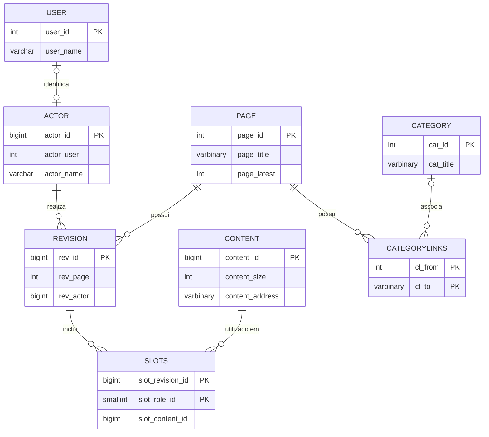

# Diagrama ER - MediaWiki

Diagrama dos relacionamentos logicos entre oito tabelas analisadas no MySQL 8.

```mermaid
erDiagram
    USER {
        int user_id PK
        varchar user_name
    }

    ACTOR {
        bigint actor_id PK
        int actor_user
        varchar actor_name
    }

    PAGE {
        int page_id PK
        varbinary page_title
        int page_latest
    }

    REVISION {
        bigint rev_id PK
        int rev_page
        bigint rev_actor
    }

    SLOTS {
        bigint slot_revision_id PK
        smallint slot_role_id PK
        bigint slot_content_id
    }

    CONTENT {
        bigint content_id PK
        int content_size
        varbinary content_address
    }

    CATEGORYLINKS {
        int cl_from PK
        varbinary cl_to PK
    }

    CATEGORY {
        int cat_id PK
        varbinary cat_title
    }

    USER o|--o| ACTOR : "identifica"
    ACTOR ||--o{ REVISION : "realiza"
    PAGE ||--o{ REVISION : "possui"
    REVISION ||--o{ SLOTS : "inclui"
    CONTENT ||--o{ SLOTS : "utilizado em"
    PAGE ||--o{ CATEGORYLINKS : "possui"
    CATEGORY o|--o{ CATEGORYLINKS : "associa"
```
